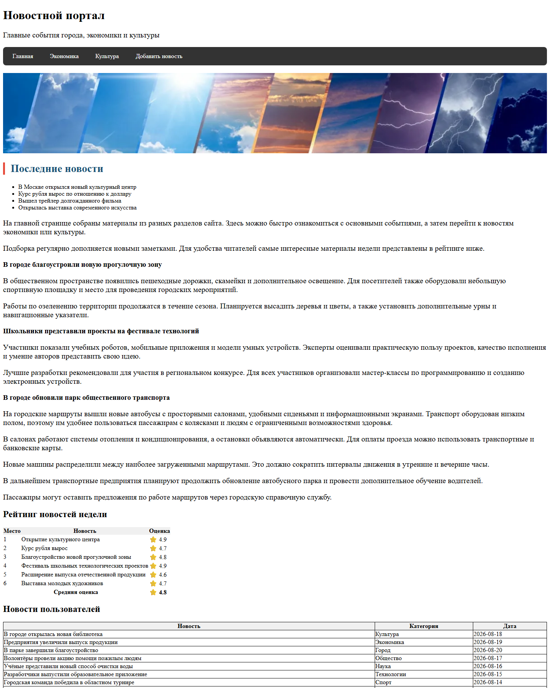
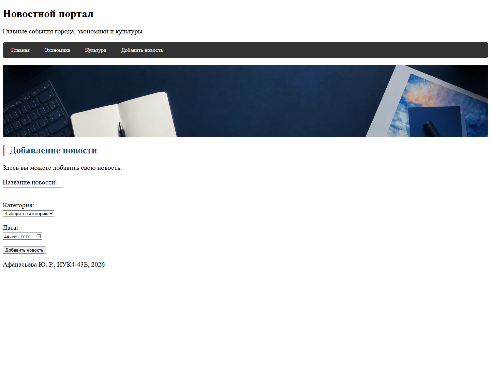

# Лабораторная работа №5. MVC. Flask. Jinja2

## Цель работы

Получить навык разработки веб-приложений с помощью микрофреймворка Flask.

## Задачи

1. Разработать серверную часть сайта с помощью Flask.
2. Создать шаблоны страниц с помощью Jinja2.
3. Реализовать динамическую загрузку и передачу данных с помощью AJAX.

Вариант №3 — новостной сайт.

## Требования задания

- использовать Flask и паттерн MVC;
- запускать приложение в отдельном виртуальном окружении;
- использовать наследование шаблонов Jinja2;
- добавить общие `header`, `footer` и панель навигации;
- вывести таблицу с данными из отдельного JSON-файла;
- реализовать добавление данных с сохранением в файл;
- загружать и передавать данные с помощью AJAX.

## Текущее состояние

На данный момент реализованы:

- Flask-приложение и четыре страницы сайта;
- простое разделение приложения по MVC;
- шаблоны Jinja2 и их наследование;
- общие `header`, навигация и `footer`;
- чтение новостей из `news.json`;
- Flask-маршрут, возвращающий новости в формате JSON;
- AJAX-загрузка новостей в таблицу без перезагрузки страницы;
- AJAX-отправка формы добавления новости;
- сохранение новой записи в `news.json`.

## Структура проекта

```text
lab5/
├── app/
│   ├── __init__.py
│   ├── model.py
│   ├── static/
│   │   ├── images/
│   │   ├── news.js
│   │   └── style.css
│   └── templates/
│       ├── adding_news.html
│       ├── base.html
│       ├── culture.html
│       ├── economics.html
│       └── index.html
├── news.json
└── run.py
```

PHP-файлы предыдущей лабораторной работы удалены после переноса сайта на Flask, поскольку новое приложение их не использует.

## Почему в навигации нет ссылки «Выйти»

В лабораторной работе №4 были реализованы регистрация, авторизация, PHP-сессия и выход пользователя. Ссылка «Выйти» вела на файл `logout.php`, который завершал PHP-сессию.

В задании лабораторной работы №5 регистрация и авторизация не указаны как обязательные. Основная задача этой работы — применение Flask, MVC, Jinja2 и AJAX. Поэтому для минимального решения авторизация из ЛР4 не переносилась, а ссылка «Выйти» была удалена. Оставлять ссылку на `logout.php` нельзя, потому что Flask-приложение не использует PHP-файлы и такая ссылка не выполняла бы заявленную функцию.

Если преподаватель требует, чтобы пятая работа полностью сохраняла возможности четвёртой, авторизацию нужно отдельно переписать на Flask: создать маршруты входа и выхода, использовать Flask-сессию и проверять доступ к страницам. Простого возвращения ссылки «Выйти» для этого недостаточно.

Таким образом, отсутствие ссылки «Выйти» является осознанным упрощением в соответствии с прямыми требованиями ЛР5, а не случайно потерянной функцией.

## Разделение по MVC

MVC разделяет приложение на модель, представление и контроллер.

- **Модель** находится в `app/model.py`. Она читает данные из `news.json`.
- **Представление** — HTML-шаблоны из директории `app/templates`.
- **Контроллер** — маршруты Flask в `app/__init__.py`. Они обрабатывают запросы и возвращают HTML или JSON.

Такое разделение позволяет изменять внешний вид страниц отдельно от кода работы с данными.

## Маршруты Flask

В приложении используются следующие маршруты:

| Адрес | Назначение |
|---|---|
| `/` | главная страница |
| `/economics` | новости экономики |
| `/culture` | новости культуры |
| `/news/add` | форма добавления новости |
| `/api/news` | получение новостей в формате JSON |

Пример обычного маршрута:

```python
@app.route("/economics")
def economics():
    return render_template("economics.html")
```

При переходе на `/economics` Flask вызывает функцию `economics()` и формирует страницу на основе шаблона `economics.html`.

## Модель

Путь к файлу данных формируется в `app/model.py`:

```python
NEWS_FILE = Path(__file__).resolve().parent.parent / "news.json"
```

`Path(__file__)` указывает на текущий Python-файл. Переход через `parent.parent` позволяет получить директорию `lab5`, в которой находится `news.json`.

Функция чтения данных:

```python
def get_news():
    with NEWS_FILE.open("r", encoding="utf-8") as file:
        return json.load(file)
```

Файл открывается в режиме чтения. Кодировка UTF-8 нужна для правильной работы с русским текстом. Функция `json.load()` преобразует содержимое JSON в список Python.

## Шаблоны Jinja2

Общие части страниц находятся в `app/templates/base.html`:

- секция `head`;
- заголовок сайта;
- панель навигации;
- основной блок страницы;
- подвал.

В базовом шаблоне определён блок:

```jinja2

```

Остальные страницы наследуют `base.html`:

```jinja2



    Содержимое конкретной страницы

```

Благодаря наследованию общая разметка не повторяется в каждом файле. Если изменить навигацию в `base.html`, она изменится на всех страницах.

Функция `url_for()` используется для формирования адресов:

```jinja2
{{ url_for("economics") }}
{{ url_for("static", filename="style.css") }}
```

В первом случае Flask строит адрес маршрута, во втором — адрес статического файла.

## AJAX-загрузка новостей

Таблица на главной странице первоначально имеет пустое тело:

```html
<tbody id="news-table-body"></tbody>
```

После загрузки страницы сценарий `app/static/news.js` выполняет запрос:

```javascript
const response = await fetch("/api/news");
const news = await response.json();
```

Запрос обрабатывается маршрутом Flask:

```python
@app.route("/api/news")
def news_api():
    return jsonify(get_news())
```

Функция `get_news()` получает данные из файла, а `jsonify()` создаёт JSON-ответ. JavaScript перебирает полученный массив, создаёт строки `tr` и ячейки `td`, после чего вставляет их в таблицу.

Это AJAX-загрузка, потому что данные запрашиваются отдельно от HTML-страницы, а таблица обновляется без полной перезагрузки сайта.

Для добавления текста используется `textContent`. Значения воспринимаются как обычный текст и не выполняются браузером как HTML-код.

## AJAX-добавление новости

Сценарий перехватывает отправку формы методом `preventDefault()`, собирает название, категорию и дату, преобразует объект в JSON с помощью `JSON.stringify()` и отправляет POST-запрос на `/api/news`.

Flask получает данные методом `request.get_json()`, проверяет обязательные поля и передаёт новую запись функции модели `add_news()`. Модель читает существующий список, добавляет в него запись и сохраняет весь список обратно в `news.json` функцией `json.dump()`.

При успешном сохранении сервер возвращает код `201` и сообщение «Новость добавлена». JavaScript выводит сообщение на странице и очищает форму без её перезагрузки.

## Виртуальное окружение и запуск

Все команды необходимо выполнять из PowerShell в директории `lab5`.

### Обычный запуск на защите

1. Перейти в директорию лабораторной работы:

   ```powershell
   cd D:\github\Cross-platform-software-development\lab5
   ```

2. Запустить приложение с помощью Python из готового виртуального окружения:

   ```powershell
   .\.venv\Scripts\python.exe run.py
   ```

3. Дождаться сообщения Flask:

   ```text
   Running on http://127.0.0.1:5050
   ```

4. Не закрывая PowerShell, открыть в браузере:

   ```text
   http://127.0.0.1:5050
   ```

5. После демонстрации вернуться в PowerShell и остановить сервер сочетанием `Ctrl+C`.

Для запуска не требуется Apache, OpenServer или встроенный PHP-сервер. Запросы обрабатывает сервер разработки Flask. Страницы нельзя открывать двойным щелчком по HTML-файлам: шаблоны Jinja2 формируются только при обращении к запущенному Flask-приложению.

Адрес из файла `з.txt` относился к прежней PHP-версии сайта. Для ЛР5 нужно использовать именно `http://127.0.0.1:5050`.

### Первоначальная настройка окружения

Эти команды нужны только в случае удаления или повреждения `.venv`:

```powershell
cd D:\github\Cross-platform-software-development\lab5
python -m venv .venv
.\.venv\Scripts\python.exe -m pip install Flask
```

После установки Flask приложение запускается обычной командой:

```powershell
.\.venv\Scripts\python.exe run.py
```

Активировать окружение командой `Activate.ps1` необязательно, потому что в командах явно указан путь к нужному `python.exe`. Это также позволяет обойти возможный запрет выполнения сценариев PowerShell.

### Быстрая проверка перед защитой

После запуска нужно проверить:

1. Главная страница открывается, а таблица «Новости пользователей» заполняется данными.
2. Ссылки «Экономика», «Культура» и «Добавить новость» работают.
3. Пустую форму нельзя отправить из-за атрибутов `required`.
4. После заполнения формы появляется сообщение «Новость добавлена» без перезагрузки страницы.
5. Новая запись появляется в конце `news.json` и в таблице после перехода на главную страницу.
6. В консоли Flask нет сообщений об ошибках.

API можно отдельно показать, открыв адрес:

```text
http://127.0.0.1:5050/api/news
```

Браузер отобразит JSON-массив. Это данные, которые JavaScript получает для заполнения таблицы.

### Возможные проблемы при запуске

- Сообщение `No module named flask` означает, что команда запущена не через `.venv` или Flask не установлен. Нужно выполнить `.\.venv\Scripts\python.exe -m pip install Flask`.
- Если адрес не открывается, следует проверить, что окно PowerShell с Flask не закрыто и в нём есть строка `Running on http://127.0.0.1:5050`.
- Сообщение о занятом порте означает, что другой экземпляр приложения уже запущен. Его нужно остановить сочетанием `Ctrl+C`.
- Если новость не сохраняется, нужно убедиться, что `news.json` существует и не открыт другой программой с блокировкой записи.
- Для загрузки Bootstrap требуется интернет. Без него основная функциональность сайта сохранится, но базовое оформление Bootstrap может не загрузиться.

## Что важно знать к защите

- `@app.route()` связывает URL с функцией Python.
- `render_template()` формирует HTML по шаблону Jinja2.
- `url_for()` строит адрес маршрута или статического файла.
- `json.load()` преобразует данные JSON в объекты Python.
- `jsonify()` преобразует данные Python в JSON-ответ Flask.
- `fetch()` отправляет AJAX-запрос из браузера.
- `response.json()` преобразует полученный ответ в JavaScript-массив.
- HTML формируется шаблонами, данные читает модель, а запросы обрабатывают маршруты.
- Таблица заполняется после загрузки страницы и не содержит заранее записанных строк новостей.

### Короткое объяснение работы

На защите устройство проекта можно объяснить так:

> Сайт разработан на Flask с применением MVC. Маршруты в `app/__init__.py` выполняют роль контроллера, функции в `app/model.py` читают и сохраняют данные, а Jinja2-шаблоны отвечают за представление. Общие элементы страниц вынесены в `base.html`, остальные шаблоны наследуют его. JavaScript отправляет AJAX-запросы маршруту `/api/news`: GET получает новости, а POST добавляет новую запись в `news.json`. Поэтому таблица и сообщение о сохранении обновляются без полной перезагрузки страницы.

### Как показать работу преподавателю

Рекомендуемый порядок демонстрации:

1. Показать команду запуска и адрес Flask-сервера.
2. Открыть главную страницу и показать таблицу из `news.json`.
3. Открыть `/api/news` и показать JSON-ответ.
4. Перейти к форме, сначала попробовать отправить её пустой.
5. Заполнить форму и добавить новость.
6. Обратить внимание, что появилось сообщение без перезагрузки страницы.
7. Вернуться на главную и показать новую строку таблицы.
8. Открыть `news.json` и показать, что запись действительно сохранена в файле.
9. Кратко показать `base.html`, `app/__init__.py`, `model.py` и два вызова `fetch()` в `news.js`.

### Возможные вопросы преподавателя

**Что такое MVC?** Модель работает с данными, представление формирует интерфейс, контроллер принимает запрос и связывает модель с представлением.

**Зачем нужен Jinja2?** Он формирует HTML по шаблонам. Наследование позволяет хранить `header`, навигацию и `footer` в одном файле `base.html`.

**Что такое AJAX?** Это обмен данными с сервером без полной перезагрузки страницы. В работе он реализован функцией `fetch()`.

**Чем отличаются GET и POST?** GET получает список новостей, POST передаёт серверу данные новой новости.

**Что делает `jsonify()`?** Преобразует данные Python в JSON-ответ и устанавливает правильный тип содержимого HTTP-ответа.

**Почему используется `textContent`?** Оно добавляет значение как текст и не позволяет интерпретировать пользовательский ввод как HTML-разметку.

**Зачем нужно виртуальное окружение?** Оно хранит Flask и его зависимости отдельно от других Python-проектов.

**Почему нет регистрации и ссылки «Выйти»?** Авторизация относилась к ЛР4 и не входит в обязательное задание ЛР5. Старый `logout.php` не работает в приложении Flask.

**Какова сложность добавления новости?** Чтение и последующая запись проходят по всему списку, поэтому временная сложность — `O(n)`, дополнительная память — `O(n)`, где `n` — количество новостей.

## Результаты проверки

Приложение запущено локально и проверено через HTTP. Страницы `/`, `/economics`, `/culture`, `/news/add` возвращают HTML с кодом `200`, а `/api/news` возвращает JSON с кодом `200`. Проверены чтение данных, проверка обязательных полей, AJAX-добавление новости и сохранение записи в `news.json`.

На главной странице JavaScript успешно заполнил таблицу данными из API:



Форма добавления новости отображается с общими элементами базового шаблона:



Оба скриншота получены при работе сайта через Flask по адресу `http://127.0.0.1:5050`, а не при открытии HTML-файлов напрямую.

## Состояние работы

Основные требования лабораторной работы выполнены. Подготовлены исходный код, JSON-данные, README, скриншоты и отчёт. Перед защитой рекомендуется один раз пройти полный сценарий запуска и добавления новости по инструкции выше.
